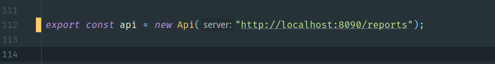

# Getting started
This project showcases the use of the Report Server API to build a simple website that lists CatalogItems in the report server, uploads new items, and gets the current user info.

The sample uses Typescript, React and Webpack to generate a SPA web app. 

## Setting up CORS
By default, the report server follows a Same-Origin policy and requires that you add localhost to the list of allowed origins before you can run this sample.

Set the values of the following configuration settings in your server:

|Property Name| New Value|
|-------------|----------|
|AccessControlAllowCredentials|True|
|AccessControlAllowHeaders|*|
|AccessControlAllowMethods|*|
|AccessControlAllowOrigin|http://localhost:8080|

To learn how to change the configuration settings, go to the [Reporting Services Documentation](https://docs.microsoft.com/en-us/sql/reporting-services/tools/server-properties-advanced-page-reporting-services)

## Setting up server url

In file src/api.js, replace the url bellow with your report server portal url.




## Getting the source code and running the sample
```bash
# clone repo
git clone https://github.com/TTcheng/PowerBiReportServerAPI-Demo.git  powerbi-api

# change directory
cd powerbi-api

# install deps
npm install # 或 yarn

# run the sample
npm run dev # 或 yarn dev
```
The samples assumes that the report server instance is running in localhost.
# announcement
The demo is modified from https://github.com/microsoft/Reporting-Services/tree/master/APISamples/typescript